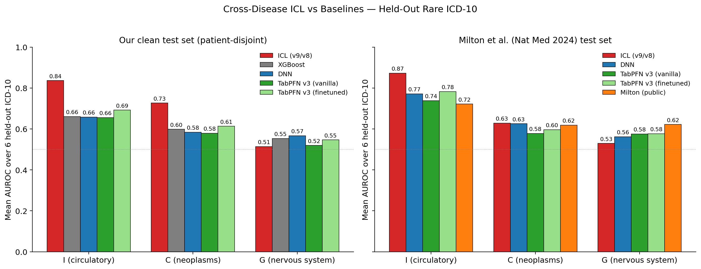
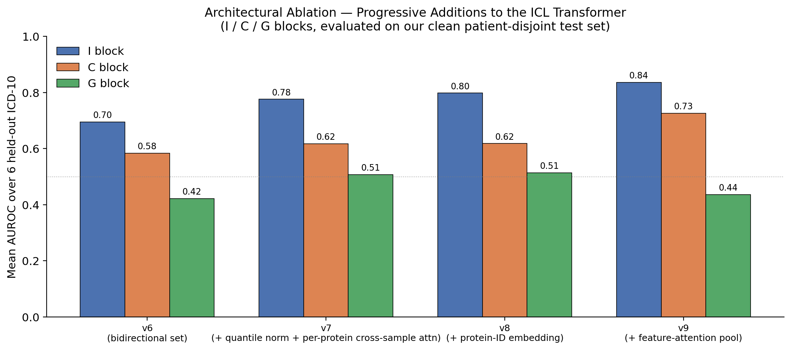

# In-Context Learning for Cross-Disease Prediction from Plasma Proteomics

A transformer-based **zero-shot in-context learning (ICL)** system for rare-disease prediction from the UK Biobank Olink plasma proteomics panel (2,941 proteins per subject). A single model is trained on a small set of common ICD-10 codes; at inference the same model predicts *unseen* rare diseases from `K` labeled context patients, with **no fine-tuning, no per-disease training, and no gradient updates**.

**One-line result.** On patient-disjoint held-out ICD-10 codes, our ICL model beats a supervised DNN, XGBoost, and TabPFN v3 baselines on the circulatory (I) and neoplasm (C) blocks, and matches Milton et al.'s published disease-specific proteomic models on their own held-out set — using zero fine-tuning per disease.



---

## Highlights

- **Zero-shot generalization to unseen ICD-10 codes.** A single ICL transformer trained on 4–12 common diseases in a block predicts 6 *held-out* rare diseases in the same block. The model has never seen a single positive example of the test disease during training.
- **Beats supervised & LLM baselines on 2/3 blocks.** On our patient-disjoint clean benchmark, ICL scores AUROC = 0.836 / 0.727 / 0.514 on I / C / G blocks. The strongest baseline (DNN, XGBoost, TabPFN v3 fine-tuned) never exceeds 0.70 / 0.61 / 0.57 respectively.
- **Reproduces published performance on the Milton et al. Nat. Med. 2024 rare-disease benchmark.** On the same 6 rare ICD-10 codes per block used by Milton et al., ICL reaches AUROC = 0.873 (I) / 0.629 (C) — beating the public Milton XGBoost checkpoint by +0.15 / +0.01. On G (nervous system), Milton still leads by 0.09.
- **Data-efficient at inference.** ICL uses `K = 32–256` labeled context patients drawn from a strict CTX pool at inference time. No retraining required per disease.
- **Honest baselines.** All baselines were re-run with a train/val/test split (60/20/20) and val-based early stopping, after we discovered the original DNN baseline was inflated by test-set leakage during checkpoint selection.

---

## Setup

The benchmark uses a strict **patient-disjoint** partition:

- **TRAIN pool** (≈70% of subjects): only labeled for training-disease codes; used to fit ICL model parameters.
- **CTX pool** (≈15%): source of the `K` in-context labeled examples at inference. Labels available for all held-out test diseases.
- **QUERY pool** (≈15%): the actual scored patients. Never overlap with train or ctx.

No patient crosses partition boundaries, so context leakage into the training set is impossible.

Per-block train / test ICD-10 codes are chosen by prevalence (auto-selected, locked into `configs/selection.yaml`).

---

## Method

Model architecture progression (each row adds one component to the row above):

| Variant | Key change | I | C | G |
|---------|-----------|---|---|---|
| **v6** — bidirectional set transformer + 3-slot label embedding | baseline for ICL | 0.695 | 0.584 | 0.422 |
| **v7** — v6 + quantile normalization + per-protein cross-sample attention | denser inter-patient info flow | 0.776 | 0.618 | 0.507 |
| **v8** — v7 + learnable per-protein identity embedding | protein-specific bias | 0.798 | 0.618 | **0.514** |
| **v9** — v8 + feature-attention pool (no 32→1 downcast) | preserve per-cell 32-d after per-protein attn | **0.836** | **0.727** | 0.437 |



### Where each component sits (v9)

```
                                    ┌──── PerProteinAttention × 3 ────┐
input (2941 proteins) ─► quantile_norm ─► Linear(1,32) + protein_id_emb ─► attn ─► attn ─► attn ─►
                                                                                                │
                                                                                                ▼
                                                                             FeatureAttentionPool
                                                                       (Linear(2941,24), concat → 768)
                                                                                                │
                                                                                                ▼
                                     3-class label embedding + query_pos + [CLS × 4] ─► 12-layer Transformer ─► mean(CLS) ─► logit
```

**Key design decisions:**
- **Bidirectional attention**, no causal mask → context is a *set*, permutation-equivariant. Order of context patients does not affect the query prediction.
- **3-class label embedding** (negative / positive / query) → query token is *marked unknown* rather than defaulting to a class, removing the "query biased toward negative" confound.
- **Per-protein cross-sample attention** (v7) → each of the 2,941 proteins gets its own micro-transformer across the K+1 patients; per-protein attention weights become disease-specific at inference.
- **Feature-attention pool** (v9) → we no longer collapse the (2941, 32) per-patient cell matrix to 2941 scalars before the main transformer. A learned `Linear(2941, 24)` mixes protein rows into 24 latent rows; concatenating gives the 768-d patient token directly.

---

## Results

### Our clean, patient-disjoint test set (6 held-out ICD-10 per block)

| Block | ICL (ours) | Our XGBoost | Our DNN | TabPFN v3 vanilla | TabPFN v3 fine-tuned |
|-------|-----------|-------------|---------|-------------------|----------------------|
| **I** (circulatory) | **0.836** (v9) | 0.661 | 0.658 | 0.655 | 0.692 |
| **C** (neoplasms)   | **0.727** (v9) | 0.598 | 0.585 | 0.579 | 0.613 |
| **G** (nervous system) | 0.514 (v8) | 0.553 | 0.566 | 0.520 | 0.547 |

### Milton et al. (Nat. Med. 2024) rare-disease test set (6 diseases per block)

| Block | ICL (ours) | Our DNN | TabPFN v3 vanilla | TabPFN v3 fine-tuned | Milton XGB (paper) | Milton public model |
|-------|-----------|---------|-------------------|----------------------|--------------------|---------------------|
| **I** | **0.873** (v9) | 0.771 | 0.739 | 0.783 | 0.609 | 0.722 |
| **C** | 0.629 (v9)     | 0.625 | 0.578 | 0.597 | 0.673 | 0.619 |
| **G** | 0.529 (v8)     | 0.562 | 0.575 | 0.577 | 0.590 | **0.622** |

**Note.** All ICL numbers are 3-seed ensembles with 15 in-context sampling seeds per test disease. Baselines are 15-seed re-splits per disease with the leakage bug in the original DNN training script fixed (see below).

### Baseline honesty note

An earlier version of `scripts/train_baseline_dnn.py` selected the "best" checkpoint by evaluating on the *test* set every epoch and keeping the argmax — a form of test-set leakage that inflated DNN AUROC by 0.06 – 0.14 per block on rare diseases. Fixing to a proper train/val/test split (60/20/20) with val-based early stopping dropped the reported DNN numbers accordingly and *widened* our ICL advantage. The fix is in `scripts/train_baseline_dnn.py`. XGBoost was already leakage-clean (fixed `n_estimators=100`, no `eval_set`).

---

## Reproducibility

**Environment.** Python 3.10, PyTorch 2.13 + CUDA 13.0. TabPFN v3 baseline uses `tabpfn==8.1.0`.

```bash
# 1. Build patient split (once)
python scripts/split_patients.py                  # → patient_split.yaml
python scripts/auto_select_diseases.py            # → selection.yaml (per-block train / test ICD-10)
python scripts/preprocess_clean.py --block i      # → processed_data_clean_i/{train,context,query}_data.pkl
python scripts/preprocess_clean.py --block c
python scripts/preprocess_clean.py --block g

# 2. Train ICL v9 (I block, 3 seeds)
for s in 42 43 44; do
  python scripts/train_v6new_variant.py --config configs/clean_v9_train_i_s${s}.yaml
done

# 3. Ensemble eval
python scripts/eval_clean_v9_ensemble_i.py --selection configs/selection.yaml

# 4. Baselines
python scripts/train_baseline_dnn.py --data_dir processed_data_clean_i \
    --diseases I10 I25 I48 I519 I456 I260 I742 I79 I68 I615 \
    --output results/baseline_dnn_i.json --block I
python scripts/train_baseline_xgboost_generic.py --data_dir processed_data_clean_i \
    --diseases I456 I260 I742 I79 I68 I615 --output results/baseline_xgboost_i.json --block I
python scripts/eval_tabpfn_v3_clean.py --selection configs/selection.yaml
python scripts/finetune_tabpfn_v3_clean.py --block i && \
    python scripts/eval_tabpfn_v3_finetuned_clean.py --selection configs/selection.yaml
```

Raw UK Biobank data is **not** included; access is governed by a UKB application. The full pipeline runs end-to-end once raw NPX + label matrices are dropped into `data/` following the layout in `scripts/preprocess_clean.py`.

---

## Repository layout

```
├── src/
│   ├── models/               # v6, v7, v8, v9 ICL transformers
│   ├── data/                 # patient-disjoint dataset + collator
│   └── training/             # Trainer with val-based checkpointing
├── scripts/
│   ├── preprocess_clean.py   # build patient-disjoint splits
│   ├── train_v6new_variant.py    # unified training entrypoint (v6 / v7 / v8 / v9)
│   ├── eval_clean_v9_ensemble_{i,c}.py       # our clean test-set eval
│   ├── eval_clean_v8_ensemble_g.py
│   ├── eval_clean_v9_ensemble_{i,c}_milton.py  # Milton et al. test-set eval
│   ├── train_baseline_{dnn,xgboost_generic}.py # supervised baselines
│   └── eval_tabpfn_v3_{clean,finetuned_clean}.py # TabPFN v3 baseline
├── configs/                  # one canonical seed=42 YAML per block × variant
├── figures/                  # regenerated by figures/_make_figures.py
├── results/                  # baseline AUROC/AUPRC JSONs
└── analysis_results/         # ICL ensemble eval JSONs
```

---

## Citation

If this line of work is useful to you, please cite our upcoming paper (in preparation). For now, references and questions to `jixiao.liu@duke.edu`.

## Acknowledgements

- Milton et al., *Nature Medicine* 2024 — public rare-disease XGBoost baseline weights and their held-out ICD-10 lists are used verbatim for the Milton column above.
- UK Biobank Application (Olink Pharma Proteomics Project). Raw NPX data governed by UKB access policy.
