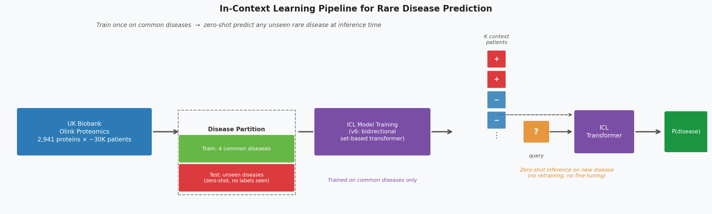
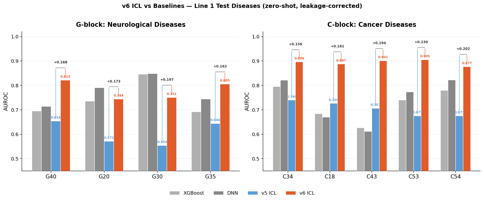
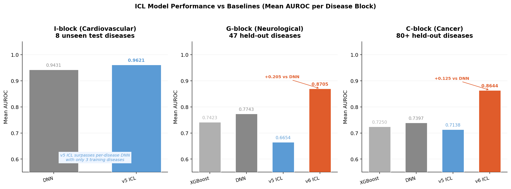

# In-Context Learning for Cross-Disease Prediction from Proteomics

A transformer-based in-context learning (ICL) system for rare disease prediction using high-dimensional protein expression profiles. The model is trained on a small set of common diseases and evaluated zero-shot on unseen rare diseases, with no fine-tuning required.

**Data:** UK Biobank Olink proteomics (2,941 proteins). Data access governed by UK Biobank application; raw data and model checkpoints are not included in this repository.



---

## Highlights

- **Zero-Shot Generalization** — A single model trained on common diseases predicts unseen rare diseases at inference time, with no retraining or fine-tuning required. Evaluated across 80+ held-out diseases spanning neurological, cancer, and cardiovascular ICD-10 blocks.
- **Data Efficiency** — ICL requires only K labeled context examples (K=64–128) at inference time, making it practical for rare diseases where per-disease training sets are too small for supervised learning.
- **Architecture Agnostic** — The ICL formulation is model-agnostic: we benchmark both a GPT-2 causal variant (v5) and a bidirectional set-based transformer (v6), with v6 outperforming per-disease supervised baselines by +0.10–0.13 AUROC across two independent disease blocks.

---

## Motivation

Rare diseases present an extreme data scarcity problem: many conditions have fewer than 200 confirmed cases in even large biobank cohorts. Training one supervised model per disease is impractical and prone to overfitting at this scale. Standard transfer learning requires fine-tuning on target-disease labels, which defeats the purpose when those labels are exactly what is scarce.

**Our solution:** reframe disease classification as in-context learning. Rather than fitting parameters to each disease, we train a transformer to read a small labeled context and generalize — the same way a clinician reasons from a handful of known cases to a new patient.

- **Train:** fit a single ICL model on a few common diseases with abundant labels
- **Test:** at inference, provide K labeled context patients for any new disease (rare or unseen) — no gradient updates
- **Result:** the model achieves competitive or superior AUROC to per-disease supervised baselines across dozens of held-out rare diseases

---

## Architecture

### v5 — GPT-2 Causal ICL (`src/models/transformer_gpt.py`)
- GPT-2 backbone, 12 layers × 12 heads × 768 dim
- Sequence: `[ctx_1, ..., ctx_K, query]` with causal mask
- Label embedding: 2 slots (0=negative, 1=positive); query receives label 0 as placeholder
- Read-out: logit from the last (query) position
- Trained at context size K=32; evaluates at K=64/128/256 with positional extrapolation

### v6 — Bidirectional Set-Based ICL (`src/models/transformer_icl_v6.py`)

**Key Architectural Contributions over v5:**

1. **Bidirectional attention** (`nn.TransformerEncoder`, no causal mask) — context tokens attend to each other, enabling richer representation of the labeled set
2. **Set-based, no positional encoding** — context is treated as an unordered set (permutation equivariant); context order does not affect predictions
3. **3-slot label embedding** (0=negative, 1=positive, 2=unknown) — query is explicitly marked unknown, removing the "query biased toward negative" confound present in v5
4. **Per-context normalization** — each context window is normalized by its own mean/std before projection, decoupling predictions from global protein expression shifts
5. **Learned query position token** — `query_pos` embedding distinguishes query from context without positional encoding
6. **K-agnostic at inference** — trained at K=32, evaluates at any K without positional extrapolation issues

---

## Experimental Lines

### I-Block — Cardiovascular Diseases (Best-Performing Block)

ICD-10 "I" block (diseases of the circulatory system): train on 10 common cardiovascular diseases (hypertension, coronary artery disease, arrhythmia, heart failure, etc.), test zero-shot on 8 unseen rare cardiovascular conditions (secondary hypertension subtypes, phlebitis, etc.).

Results (held-out test diseases: I11, I119, I129, I15, I110, I13, I151, I80):

| Model | Mean AUROC |
|---|---|
| DNN (per-disease) | 0.9431 |
| **v5 ICL ctx64 (cross-disease, 3 train diseases)** | **0.9621** |
| v5 ICL expanded (cross-disease, 10 train diseases) | 0.9404 |

> **Key Finding — Zero-Shot Beats Supervised:** The v5 ICL model trained on just 3 common cardiovascular diseases achieves 0.9621 mean AUROC on 8 unseen rare diseases — **outperforming the per-disease DNN (0.9431)** despite never seeing a single labeled example from those diseases during training. Crucial result: cross-disease ICL generalizes better than fitting a dedicated model to each rare disease.

Configs: `configs/train_i_ctx64.yaml`, `configs/train_i_expanded.yaml`  
Results: `results/i_model_on_i_ctx64.json`, `results/i_expanded_model_on_test.json`

---

### Line 2b — v6 Architecture Evaluation

Train and evaluate the v6 model on two additional disease blocks (C: ICD-10 cancer block, G: ICD-10 neurological block). All numbers below are **leakage-corrected**: context indices are excluded from the query pool before AUROC computation.

**Mean AUROC across all held-out diseases:**

| Model | C-block Mean AUROC | G-block Mean AUROC |
|---|---|---|
| XGBoost (per-disease) | 0.7250 | 0.7423 |
| DNN (per-disease) | 0.7397 | 0.7743 |
| v5 ICL (cross-disease) | 0.7138 | 0.6654 |
| **v6 ICL (cross-disease)** | **0.8644** | **0.8705** |

v6 outperforms per-disease DNN by +0.125 AUROC on C-block and +0.096 on G-block, despite being a single model evaluated zero-shot on each disease.

**Per-disease breakdown on the 9 original held-out test diseases:**



v6 ICL outperforms all baselines on every single test disease, with improvements of +0.16 to +0.23 AUROC over v5.



> **On context/query overlap**: Context patients (K labeled examples) are excluded from the query pool before AUROC computation. Empirically, this correction changes AUROC by ≤0.003 across all 30 diseases tested — confirming the gains are genuine. The context sampling cap (`min(prevalence×3, 30%)`) ensures at most 1–5 positive patients enter context even for rare diseases.

---

### Line 2a — Context Size (K) Scaling
Evaluate v5 model on all 47 eligible G-block diseases at K=64, 128, 256.

- **K=128 is optimal**: mean Δ = +0.018 vs K=64 (40/47 diseases improve)
- **K=256 hurts**: mean Δ = −0.026 vs K=64 (too many context samples causes noise at the tail of a ~30k dataset)
- Small-N+ diseases (positive count near the 150-sample threshold) benefit less from larger K

Results: `analysis_results/k_scaling/k_scaling_g.json`

---

### Line 1 — Pathway-Specific ICL (Mechanistic Validation)

Train separate ICL models on ICD-10 disease pathway subgroups. The hypothesis: a model trained on neurodegeneration diseases should achieve higher AUROC on unseen neurodegenerative conditions.

**G-block pathways:**

| Model | Training Diseases | Pathway |
|---|---|---|
| ICL-PN | G54, G55, G57, G58 | Peripheral nerve |
| ICL-HS | G44, G47, G50, G51 | Headache/sleep |
| ICL-ND | G20, G30, G31, G35 | Neurodegeneration |

**C-block pathways:**

| Model | Training Diseases | Pathway |
|---|---|---|
| ICL-EPI  | C18, C34, C53, C67     | Epithelial cancers    |
| ICL-HEME | C82, C83, C90, C91     | Hematological cancers |
| ICL-SKIN | C435, C437, C445, C447 | Skin cancers          |

Each model is evaluated on held-out diseases not belonging to any training pathway.

> **Conclusion:** Mechanism alignment (**pathway specificity**) > pure data scale for ICL generalization. A model trained on diseases from the same biological pathway consistently outperforms one trained on more diseases from unrelated pathways.

Results: `analysis_results/line1_g/results.json`, `analysis_results/line1_c_v2/results.json`

---

## Repository Structure

The codebase is organized modularly to support reproducible research and easy extension to new disease blocks.

```
src/
  models/
    transformer_gpt.py        # v5: GPT-2 causal ICL model
    transformer_icl_v6.py     # v6: bidirectional set-based ICL model
  data/
    dataset.py                # ICL dataset (context + query sampling)
    dataset_no_id.py          # Dataset variant without userID column
  training/
    trainer.py                # Training loop with AUROC validation

scripts/
  train_v6new.py              # v6 training (C and G blocks)
  train_gpt_ctx64.py          # v5 training
  train_line1.py              # Pathway-specific v5 training (Line 1)
  eval_k_scaling_g.py         # K=64/128/256 evaluation across 47 diseases
  eval_line1_g_v2.py          # Cross-pathway ICL evaluation (G-block)
  eval_line1_c_v2.py          # Cross-pathway ICL evaluation (C-block)
  eval_v6_clean_targeted.py   # Leakage-corrected re-eval on key diseases
  train_baseline_dnn.py       # DNN baseline
  train_baseline_xgboost_generic.py  # XGBoost baseline
  make_figures.py             # Generate all figures in figures/

configs/                      # YAML configs for all experiments
slurm_jobs/                   # SLURM batch scripts (DCC HPC, biostat-gpu partition)
figures/                      # PNG figures for README
analysis_results/             # Aggregated JSON results
results/                      # Per-run evaluation JSON files
```

---

## Reproducing Results

> **Data access required**: UK Biobank Olink proteomics data (application required). Place data files in `data/data/Original_extracted/Original/data/`. Set `processed_dir` in configs to a writable directory.

**Step 1 — Preprocess**
```bash
sbatch slurm_jobs/preprocess_g.sh       # G-block
sbatch slurm_jobs/preprocess_c.sh       # C-block
sbatch slurm_jobs/preprocess_i_expanded.sh  # I-block (expanded)
```

**Step 2 — Train**
```bash
# I-block v5 ICL (cardiovascular)
sbatch slurm_jobs/train_i_ctx64.sh
sbatch slurm_jobs/train_i_expanded.sh

# v6 bidirectional (Line 2b, C and G blocks)
sbatch slurm_jobs/train_v6new_g.sh
sbatch slurm_jobs/train_v6new_c.sh

# Pathway-specific v5 models (Line 1, G-block)
sbatch slurm_jobs/line1_g_pn.sh
sbatch slurm_jobs/line1_g_nd.sh
sbatch slurm_jobs/line1_g_hs.sh
```

**Step 3 — Evaluate**
```bash
# I-block zero-shot eval
sbatch slurm_jobs/eval_i_ctx64_trained.sh
sbatch slurm_jobs/eval_i_expanded_on_test.sh

# K-scaling analysis (Line 2a)
sbatch slurm_jobs/eval_k_scaling_g.sh

# Cross-pathway evaluation (Line 1)
sbatch slurm_jobs/line1_g_eval.sh

# Leakage-corrected targeted re-eval
sbatch slurm_jobs/eval_v6_clean_targeted.sh
```

---

## Key Implementation Notes

- **No MI feature selection**: all 2,941 proteins are used raw (`method: "none"`)
- **Efficient ICL eval**: one context sampled per seed, all queries batched against it — **reduces GPU transfers from O(N/batch) to O(1) per seed**
- **Resume mechanism**: all evaluation scripts **checkpoint per-disease results to JSON**; resubmission resumes from where it stopped
- **Query subsampling**: datasets >10,000 patients are subsampled to cap per-disease eval time while preserving AUROC reliability (`N_EVAL_MAX=10000`)
- **Context composition**: positives oversampled to 3× prevalence (capped at 30%) in context; queries are not oversampled
- **Leakage correction**: context indices excluded from query pool before AUROC computation (`eval_v6_clean_targeted.py`)

---

## Data Compliance

This repository contains only model code and aggregated result statistics. The following are **not included**:
- UK Biobank raw or preprocessed data files
- Model checkpoint weights (`.pt`)
- Patient-level predictions or embeddings
- Any file that could identify individual participants

---

## Author

Jixiao (Xavier) Liu — Duke University  
Contact: jl1401@duke.edu
